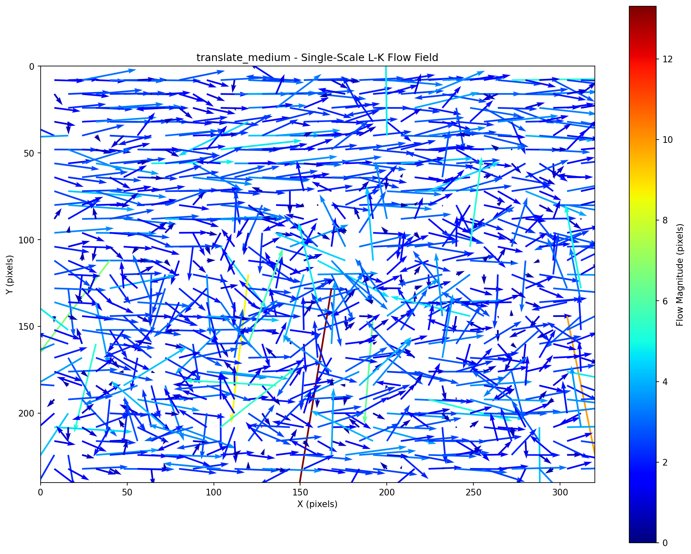
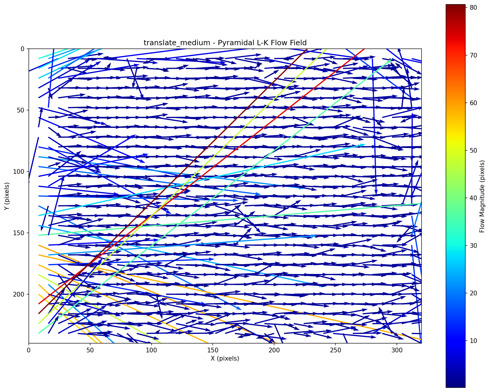
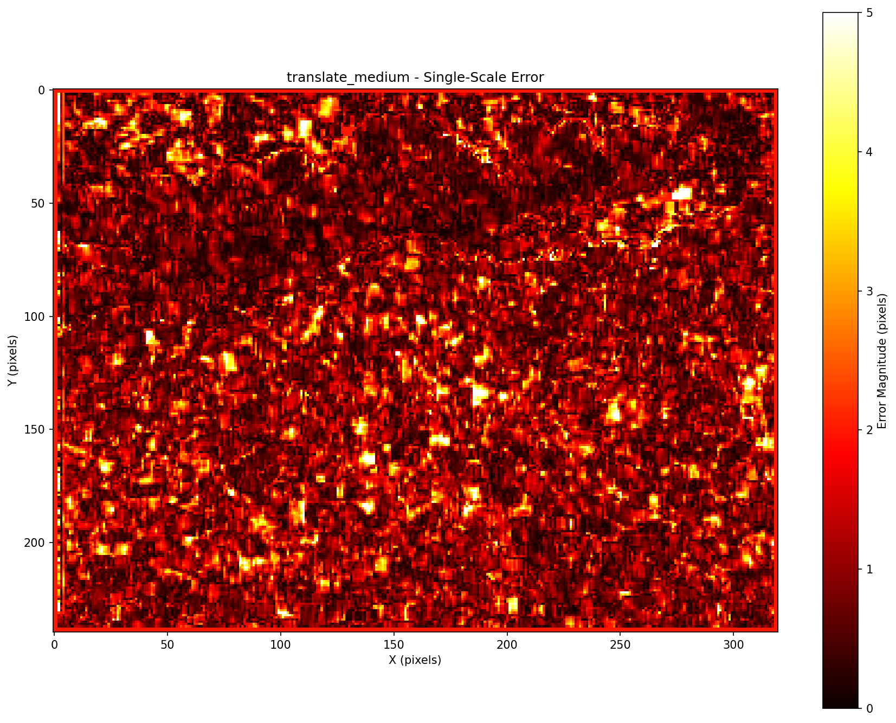
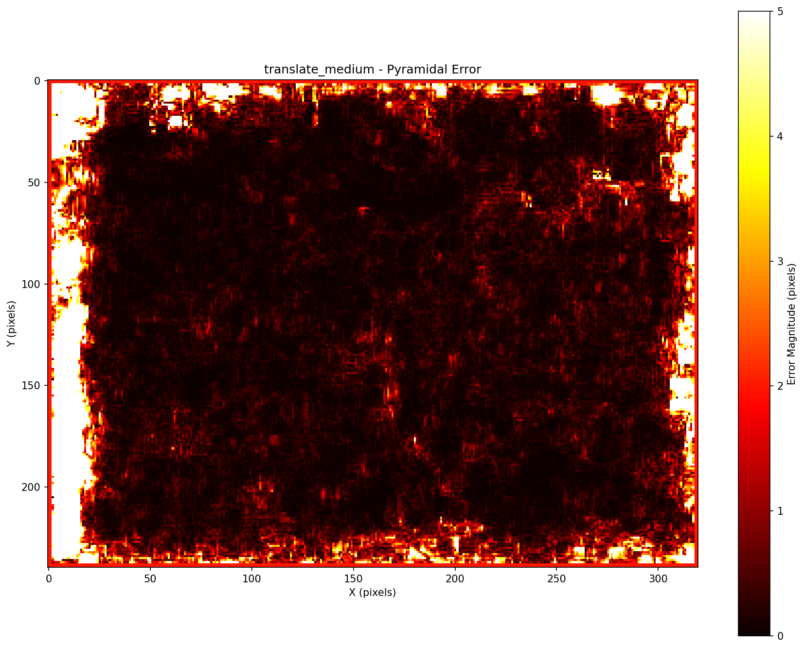
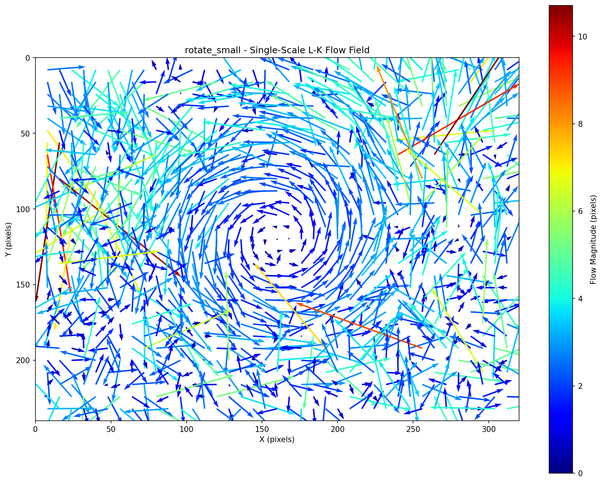
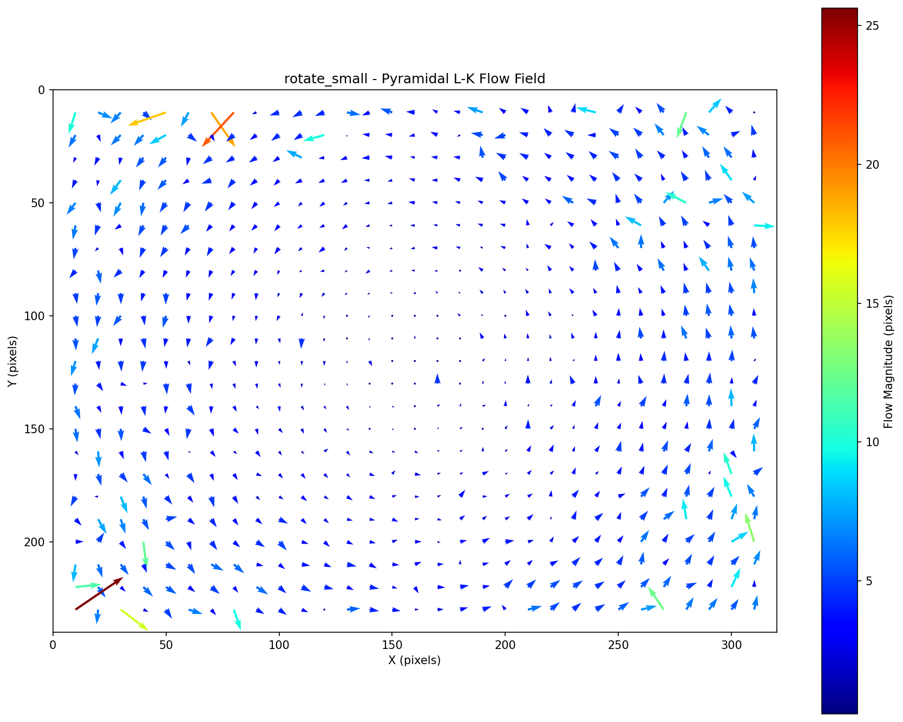
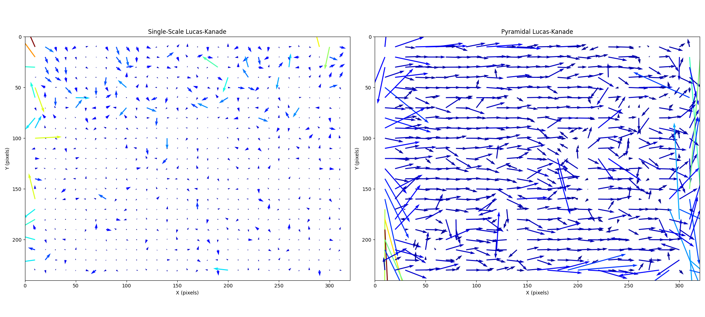
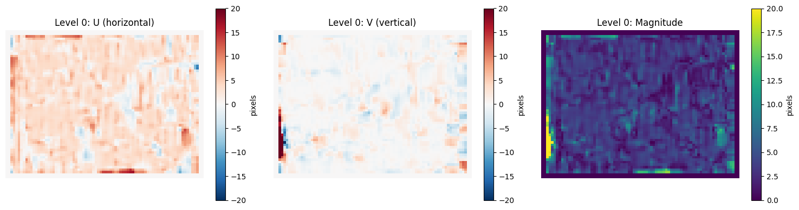
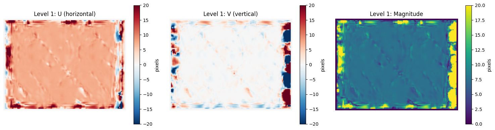
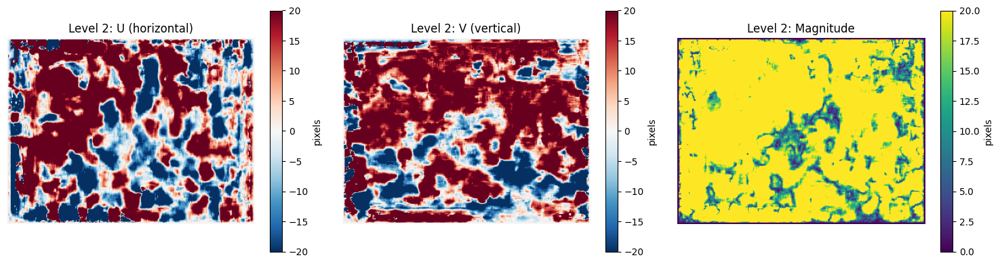

# Optical Flow on FPGA

Real-time Lucas-Kanade optical flow implementation on Nexys A7-100T FPGA.

---

## Folder Structure
```
optical-flow-fpga/
├── .github/
| └── workflows/   # CI/CD workflows
├── constraints/   # Timing constraints (XDC)
├── docs/          # Documentation
├── prj/           # Vivado project files
│ ├── unopt/ # Unoptimized build artifacts
│ └── opt/ # Optimized build artifacts
├── python/        # Test generation and reference implementation
├── rtl/           # RTL source files (SystemVerilog)
│ ├── common/      # Shared modules (line buffers, frame buffer)
│ ├── unopt/       # Unoptimized implementation (fails timing)
│ └── opt/         # Optimized implementation (meets timing)
├── scripts/       # Build automation scripts
└── tb/            # Testbenches and test data
  └── test_frames/ # Generated .mem files
```

---

## Hardware

- **Board:** Digilent Nexys A7-100T
- **FPGA:** Xilinx Artix-7 (xc7a100tcsg324-1)
- **Resources:** 15,850 slices, 240 DSP48E1 slices, 4,860 Kb BRAM

---

## Architecture

### Lucas-Kanade Optical Flow

3-stage pipeline:

1. **Gradient Compute**: Sobel operators -> spatial gradients (Ix, Iy) + temporal difference (It)
2. **Window Accumulator**: 5×5 sliding window -> structure tensor components (Σ Ix², Σ Iy², Σ IxIy, etc.)
3. **Flow Solver**: Cramer's rule -> solve 2×2 system for (u, v) flow vectors

This RTL implements single-scale Lucas-Kanade, suitable for motions <5 pixels. Python reference includes both single-scale and pyramidal implementations.

---

## Verification

### Verification

#### Quick Start

```bash
# Generate test patterns
python python/generate_test_suite.py

# Run verification suite
python python/optical_flow_verifier.py

# Test specific patterns
python python/optical_flow_verifier.py --pattern translate_medium rotate_small
```

#### Regression Testing

Automated baseline comparison for catching algorithm changes.
```bash
# Create initial baseline (run once after validating results)
python python/optical_flow_verifier.py --update-baseline

# Compare current implementation against baseline
python python/optical_flow_verifier.py --compare-baseline

# Adjust sensitivity (default: 10% threshold)
python python/optical_flow_verifier.py --compare-baseline --regression-threshold 5.0

# Update baseline after verified algorithm improvements
python python/optical_flow_verifier.py --update-baseline
```

What gets flagged:
- MAE (horizontal/vertical) changes >10%
- EPE (endpoint error) changes >10%

Example output:

```
========================================================
Regression Testing: Comparing Against Baseline
========================================================

translate_medium (Single-Scale):
    Regression detected:
    - mae_u: +12.3% change (current=1.51, baseline=1.34)

translate_medium (Pyramidal):
    Pass

========================================================
Regression detected in 1 test(s)
========================================================
```

Baseline location: `python/verification_baseline.json` (committed to repo).

### Python Reference Models

Two implementations provided for algorithm development and RTL verification:

**Single-Scale Lucas-Kanade** (`python/lucas_kanade.py`):
- Structure tensor computation with Gaussian weighting
- Least-squares flow solver (2×2 linear system)
- Suitable for small motions (<5 pixels)
- Serves as primary model for RTL verification

**Pyramidal Lucas-Kanade** (`python/lucas_kanade_pyramidal.py`):
- 3-level Gaussian pyramid with 2x downsampling
- Coarse-to-fine iterative refinement
- Handles large motions (tested up to 20 pixels)
- Demonstrates aperture problem mitigation

### Automated Test Suite

Comprehensive verification across 13 synthetic patterns:

```bash
# Generate test patterns
python python/generate_test_suite.py

# Run verification suite
python python/optical_flow_verifier.py

# Test specific patterns
python python/optical_flow_verifier.py --pattern translate_medium rotate_small
```

#### Tabulated Results

| Pattern           | Ground Truth | Single-Scale MAE | Pyramidal MAE | Single Status | Pyramidal Status |
|-------------------|--------------|------------------|---------------|---------------|------------------|
| translate_small   | (0.5, 0.5)   | 0.31 / 0.27      | 0.65 / 0.72   | Pass          | Warning          |
| translate_medium  | (2.0, 0.0)   | 1.34 / 0.77      | 0.53 / 0.37   | Warning       | Warning          |
| translate_large   | (15.0, 0.0)  | 14.82 / 2.06     | 6.04 / 4.90   | Fail          | Fail             |
| rotate_small      | (0.0, 0.0)   | 1.21 / 1.14      | 0.78 / 0.94   | Warning       | Pass             |
| rotate_medium     | (0.0, 0.0)   | 1.09 / 1.57      | 1.78 / 1.89   | Warning       | Warning          |
| zoom_in           | (0.0, 0.0)   | 1.17 / 1.74      | 2.02 / 2.10   | Warning       | Warning          |
| translate_rotate  | (5.0, 5.0)   | 4.78 / 4.85      | 1.13 / 1.29   | Fail          | Warning          |
| no_motion         | (0.0, 0.0)   | 0.00 / 0.00      | 0.00 / 0.00   | Pass          | Pass             |
| translate_extreme | (30.0, 20.0) | 29.65 / 18.93    | 34.24 / 21.15 | Fail          | Fail             |

*MAE (Mean Absolute Error) format: horizontal / vertical (pixels). Full metrics in `python/verification_results.md`.*

##### Summary of Results
- Single-scale excels at sub-pixel motion (0.31px MAE on small translation)
- Pyramidal approach reduces error by ~59% on large translations (14.8 to 6.0px)
- Combined motion benefits most from pyramid (4.8 to 1.3px MAE improvement)
- Both methods struggle with extreme motion (>20px) which is expected

#### Visual Comparison: Medium Translation (2px)

<div align="center">
  <table>
    <tr>
      <td align="center">
        
        <br><em>Single-Scale: MAE = 1.34px (horizontal)</em>
      </td>
      <td align="center">
        
        <br><em>Pyramidal: MAE = 0.53px (horizontal)</em>
      </td>
    </tr>
    <tr>
      <td align="center">
        
        <br><em>Error distribution: single-scale</em>
      </td>
      <td align="center">
        
        <br><em>Error distribution: pyramidal (more uniform)</em>
      </td>
    </tr>
  </table>
</div>

#### Visual Comparison: Small Rotation (2°)

<div align="center">
  <table>
    <tr>
      <td align="center">
        
        <br><em>Single-Scale: Circular flow pattern</em>
      </td>
      <td align="center">
        
        <br><em>Pyramidal: Smoother flow recovery</em>
      </td>
    </tr>
  </table>
</div>

**Note:** Rotation patterns show elevated MAE even for small angles due to Lucas-Kanade's constant motion assumption. This is expected behavior - the algorithm assumes uniform translation within the window, but rotation creates spatially-varying flow.

### Verification Results

#### Test Case: 15-Pixel Horizontal Motion

<div align="center">
  
  <p><em>Left: Single-scale (fails on large motion). Right: Pyramidal (successful coarse-to-fine refinement).</em></p>
</div>

#### Pyramid Level Breakdown

<div align="center">
  <table>
    <tr>
      <td align="center">
        
        <br><em>Level 0: 80×60 px (coarsest)</em>
      </td>
      <td align="center">
        
        <br><em>Level 1: 160×120 px</em>
      </td>
      <td align="center">
        
        <br><em>Level 2: 320×240 px (finest)</em>
      </td>
    </tr>
  </table>
</div>

**Note**: Poor performance is expected at edges.

#### Convergence Behavior

```
============================================================
Pyramidal Lucas-Kanade Optical Flow
============================================================
Loaded frames: 320x240
Pyramid levels: 3
Window size: 5x5
Iterations per level: 3

============================================================
Running Pyramidal Lucas-Kanade...
============================================================
Building 3-level Gaussian pyramids...
Pyramid levels:
  Level 0: 80x60 pixels
  Level 1: 160x120 pixels
  Level 2: 320x240 pixels

Processing pyramid level 0/2...
  Iteration 1/3: mean residual = (4.0603, 0.5694)
  Iteration 2/3: mean residual = (0.8930, 0.9292)
  Iteration 3/3: mean residual = (0.2696, 0.5366)

Processing pyramid level 1/2...
  Upsampled flow to 160x120
  Iteration 1/3: mean residual = (0.7448, 1.9079)
  Iteration 2/3: mean residual = (0.5363, 1.1262)
  Iteration 3/3: mean residual = (0.5325, 1.2620)

Processing pyramid level 2/2...
  Upsampled flow to 320x240
  Iteration 1/3: mean residual = (2.5990, 4.9165)
  Iteration 2/3: mean residual = (2.1149, 3.8442)
  Iteration 3/3: mean residual = (2.0820, 4.1527)

============================================================
Pyramidal Results
============================================================
Mean flow in test region: u=15.081, v=0.134
Std dev in test region:   u=0.231, v=0.452
Expected: u=15.0, v=0.0 (from generate_test_frames_natural.py --displacement-x 15)
```

Flow field visualizations regenerate automatically when running the comparison script.

---

## Tools

### Required
- **Vivado**: 2022.2+ (Xilinx/AMD)
- **Python**: 3.12+ with NumPy, SciPy, Matplotlib
- **OS**: Linux Mint 21.3 (any Debian-based distro should work)

### Development (Optional)
- **Linting**: Verible (SystemVerilog), mypy (Python)
- **Environment**: [direnv](https://direnv.net/) for automatic venv activation

> **Note**: Other Vivado/Python versions may work but are untested.

---

## Building

This repo uses configuration-based builds to demonstrate timing optimization.

Unoptimized:
```bash
./scripts/build.sh unopt
```

Optimized:
```bash
./scripts/build.sh opt
```

Reports generated in `prj/<config>/`:

- Critical path analysis - `timing_summary_<config>.rpt`
- Resource usage - `utilization_<config>.rpt`

---

## Testing

### Python Reference Model

Generate test frames with checkerboard pattern.

Small motion (2 pixels):
```bash
python python/generate_test_frames.py --displacement-x 2
```

Run Lucas-Kanade reference:
```bash
python python/lucas_kanade.py
```

Large motion (15 pixels):
```bash
# Generate test pattern with large motion
python python/generate_test_frames_natural.py --displacement-x 15
# Compare methods
python python/lucas_kanade_pyramidal.py --compare
```

**Note**: The `python/test_data/` directory contains cached image(s) used for test frame generation (source: Wikimedia Commons).

### RTL Simulation

#### Option 1: Vivado GUI

Open the Vivado project:
```bash
vivado prj/optical_flow_fpga_prj/optical_flow_fpga_prj.xpr
```
From within the project, run the simulation using **Flow Navigator -> Run Simulation -> Run Behavioral Simulation**

#### Option 2: Terminal (Recommended)

Run:
```bash
./scripts/run_sim.sh tb_optical_flow_top
```

To enable waveform dump, run this instead:
```bash
./scripts/run_sim.sh tb_optical_flow_top 1
```

Expected output:
```bash
============================================
Optical Flow Accelerator Testbench
============================================
...
Flow Statistics (Test Region):
  Mean:     u= 2.013, v= 0.042
  Expected: u= 2.000, v= 0.000
  Error:    u= 0.013, v= 0.042

*** TEST PASSED ***
Flow vectors within tolerance (±0.5 pixels)
```

---

## Setup

### Environmental Setup (Required)

#### Method 1: With direnv

Repository uses `direnv` to manage the Python virtual environment and dependencies.

If `direnv` is not already installed, run:
```bash
sudo apt install direnv
echo 'eval "$(direnv hook bash)"' >> ~/.bashrc
source ~/.bashrc
```

From within the cloned repository folder, set up the virtual environment and install dependencies using:
```bash
direnv allow .
```

#### Method 2: Without direnv

From within the repository folder, run:
```bash
python3.12 -m venv .venv
source .venv/bin/activate
pip install -e ".[dev]"
pre-commit install
```

### Development Setup (Optional)

For contributors that want to modify RTL or Python code to be pushed up to this repository.

Uncomment the Vivado path exports in `.envrc`.

Then, install necessary dev tools:
```bash
./scripts/setup_verible.sh
pip install -e ".[dev]"
pre-commit install
```

Linters can be ran manually using:

#### RTL
```bash
verible-verilog-lint
```

#### Python
```bash
mypy
```

These tools are not required for building or simulating the design.

---

## License

MIT License (MIT) - See LICENSE file for details.

---

## Author

[Joshua Rothe](http://joshrothe.us)
