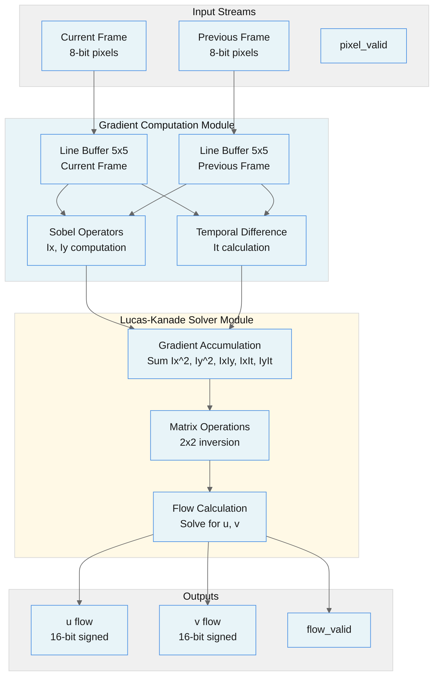
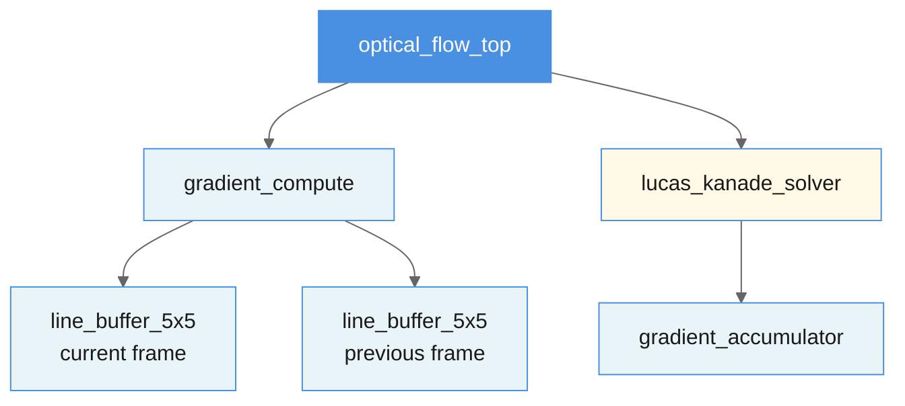
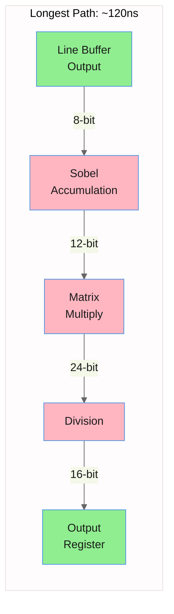

# Optical Flow Accelerator Architecture

All block diagrams created using [Mermaid](https://mermaid.ai/open-source/syntax/block.html) in markdown.

## Top-Level Block Diagram

---

## Module Heirarchy

---

### Data Flow

The accelerator processes frames in a streaming fashion.

#### Line Buffering (5 cycles latency)
- Builds 5x5 windows for spatial operations
- Maintains separate buffers for current/previous frame

#### Gradient Computation (1 cycle - combinational)
- Sobel X/Y operators on averaged frame: $I_{avg} = \frac{I_{curr} + I_{prev}}{2}$
- Spatial gradients: $I_x$, $I_y$ via convolution
- Temporal gradient: $I_t = I_{prev} - I_{curr}$ on center pixels
- Combinational Sobel accumulation (critical path)

#### Flow Solver (1 cycle - combinational)
- Accumulates gradients over 5x5 window:
$$
A = \begin{bmatrix}
\sum I_x^2 & \sum I_x I_y \\
\sum I_x I_y & \sum I_y^2
\end{bmatrix}, \quad
b = -\begin{bmatrix}
\sum I_x I_t \\
\sum I_y I_t
\end{bmatrix}
$$
- Matrix inversion: Computes $\det(A)$, checks solvability
- Flow solution: $\mathbf{u} = [u, v]^T = A^{-1} \mathbf{b}$ via Cramer's rule
- Matrix multiplication and division (critical path)

---

# Critical Timing Paths (Unoptimized)

